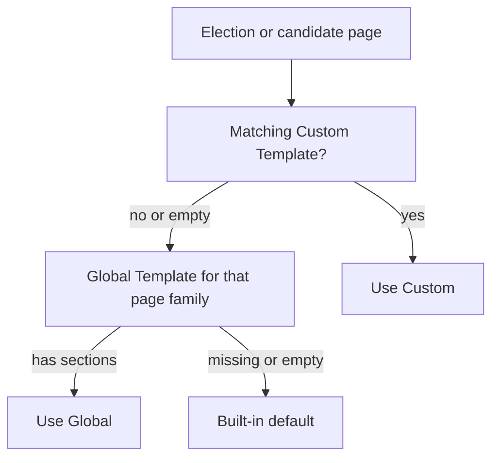

# Election templates: editor guide

How to control the layout and copy on GoodParty.org election and candidate pages
from Sanity Studio. No code or deploy is required for normal edits.

Studio: [https://goodparty-marketing.sanity.studio/studio/main](https://goodparty-marketing.sanity.studio/studio/main)

In the left nav: **Goodparty.org → Templates**.

---

## What this feature is

Election and candidate pages are not built one by one. Each page family uses a
**template**: a list of page sections (blocks) plus token-driven copy.

There are two kinds:

| Kind | What it does |
| ---- | ------------ |
| **Global Templates** | Site-wide default for one page family (all states, all counties, and so on). |
| **Custom Templates** | Override the global for specific places, races, or candidates you target. |

Page families (one Global Template each):

- Location - State (example: `/elections/ny`)
- Location - County (example: `/elections/wi/adams-county`)
- Location - City (example: `/elections/wi/adams-county/adams`)
- Location - District (example: `/elections/mn/minneapolis-public-school-district`)
- Position page (example: `/elections/ny/position/governor`)
- Position Candidates list (example: `/elections/ny/position/governor/candidates`)
- Candidate Profile (example: `/candidate/janet-mills/us-senate-maine`)

---

## How pages choose a template

1. If an **enabled Custom Template** matches this page (by Targets), use it.
2. Otherwise use the **Global Template** for that page family.
3. If that Global is missing or has no sections, use the **built-in default**.

Among Custom Templates that all match, the most specific target wins. Ties use
the lower **Priority** number (default 100).

---

## Editing a Global Template

1. Open **Templates → Global Templates**.
2. Open the page family you want (for example **Location - State**).
3. Edit **Page Sections** like any other page builder: add, remove, reorder
   blocks, and change copy.
4. Open the **Preview** group and set **Preview Target** (see cheat sheet below).
5. Open the site preview tab and confirm the draft looks right.
6. **Publish**.

Do not create extra Global documents for the same page family. Use the seven
fixed entries in the Global Templates list.

---

## Preview Target cheat sheet

Preview Target tells Studio which real URL to open in the iframe.

| Template | Preview Target Type | Preview Slug example | Position Slug |
| -------- | ------------------- | -------------------- | ------------- |
| Location - State | Place | `ny` | (hidden) |
| Location - County | Place | `wi/adams-county` | (hidden) |
| Location - City | Place | `wi/adams-county/adams` | (hidden) |
| Location - District | Place | `mn/minneapolis-public-school-district` | (hidden) |
| Position | Place | `ny` | `governor` |
| Position Candidates | Place | `ny` | `governor` |
| Candidate Profile | **Candidate** | `janet-mills/us-senate-maine` | (hidden) |

Rules:

- Do not add leading or trailing `/`.
- For **Candidate Profile**, choose **Candidate**, not Place. Paste the candidate
  slug from a live profile URL after `/candidate/`.
- **Position Slug** only appears for Position and Position Candidates templates.
  It is the last URL segment (for example `governor`), not the full race slug.
- If **Candidate** is missing from the list, hard-refresh Studio or confirm you
  are on `https://goodparty-marketing.sanity.studio/studio/main`.

---

## Creating a Custom Template

Sanity cannot change a document’s type. Do **not** duplicate a Global and try to
turn it into a Custom.

### Clone from a Global (recommended)

1. Open the Global Template for the page family you want to override.
2. Go to **Page Sections**.
3. Open the field actions menu on **Page Sections** → **Copy field**.
4. Go to **Templates → Custom Templates** → create a new document.
5. Set **Title** (internal label only).
6. Set **Template Type** to the same page family as the Global you copied.
7. Leave **Enabled** on.
8. Set **Priority** if needed (lower number wins ties; default 100).
9. Paste into **Page Sections** (field actions → **Paste field**).
10. Add at least one **Target** (see valid combinations below).
11. Set **Preview Target** to a page that should show this custom version.
12. Edit sections / tokens as needed.
13. Confirm the Studio preview.
14. **Publish**.

Optional: set **Cloned from Global Template** for lineage only. It does not
affect matching.

---

## Valid target combinations

Custom **Targets** decide which live pages use this template.

| Template Type | Use this Target Type | Slug examples |
| ------------- | -------------------- | ------------- |
| Location - State / County / City / District | **Place** only | `ny`, `wi/adams-county`, `wi/adams-county/adams`, `mn/minneapolis-public-school-district` |
| Position or Position Candidates | **Place** or **Position** | Place: `ny`. Position: full race slug such as `ny/governor` (not only `governor`) |
| Candidate Profile | **Candidate** only | `janet-mills/us-senate-maine` |

Place targets match by prefix. A Place target of `ny` can match New York state
and deeper places under New York for that template type. Prefer longer slugs when
you only want a county or city.

---

## Tokens (dynamic copy)

In plain text (and supported rich text) fields, use bracket tokens. The site
replaces them per page. Unmatched known tokens are removed so raw `[token]` text
does not show.

| Token | Typical pages |
| ----- | ------------- |
| `[State]` | Location, position, candidates |
| `[County]` | County / city location |
| `[City]` | City location |
| `[District]` | District location |
| `[County or City]` | Position / candidates |
| `[location]` | Position / candidates |
| `[office]` / `[office name]` | Position / candidates / profile |
| `[candidate name]` | Candidate profile |

Example: `Upcoming elections in [State]` on a New York state page becomes
`Upcoming elections in New York`.

---

## Publish checklist

Use this before asking someone else to review a Custom Template:

1. Draft preview in Studio looks correct on the Preview Target URL.
2. Publish the Custom Template.
3. Open the **target** public page and confirm your change is live.
4. Open a **nearby non-target** page of the same family and confirm it still uses
   the Global Template.
5. Turn **Enabled** off, publish again, and confirm the target page returns to
   the Global Template.
6. Turn **Enabled** back on only when you are ready for the override to stay.

Global Template edits: publish, then check one representative page for that
family (use the Preview Target URL).

---

## Troubleshooting

| Problem | What to try |
| ------- | ----------- |
| Preview is blank or wrong | Set Preview Target Type + Preview Slug (and Position Slug when shown). Click reload on the preview pane. |
| No **Candidate** option | Hard-refresh Studio. Use the hosted Studio URL above. For Candidate Profile you must pick **Candidate**. |
| Published change not on the site | Wait a minute and hard-refresh the public page. If it stays stale, ask engineering to check the revalidation webhook for template document types. |
| Custom Template does nothing | Confirm Enabled is on, Template Type matches the page family, Targets use the correct type and slug format, and Page Sections is not empty. |
| Wrong pages pick up a Custom | Place prefixes are broad (`ny` matches deep New York places for that type). Use a longer Place slug or a higher Priority number on broader templates. |
| Position Custom never matches | Use the **full race slug** (for example `ny/governor`), not only `governor`. |
| One block is empty | A single broken block can hide itself. Fix that block’s fields; the whole page may not switch to Global. |

---

## What this guide does not cover

- Changing how templates behave in code, adding new block types, or new token
  names (that needs engineering).
- Fixing wrong candidate data on a profile (usually upstream data, not the
  template).

For “is this a Studio edit or a code change?”, see `docs/content-vs-code.md`.
