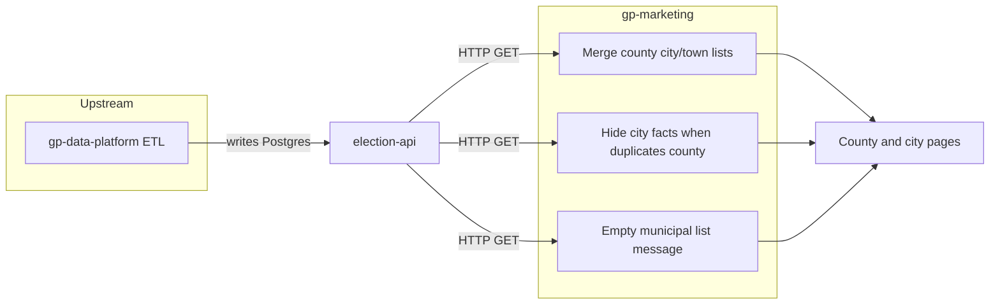

# Elections pages — known limitations and ownership

**Audience:** Product, gp-marketing, election-api, and gp-data-platform / ETL.

**Purpose:** Source of truth for upstream place-data gaps, how to verify them via election-api and the site, what gp-marketing already mitigates, and what **not** to re-investigate in the marketing repo.

**Last validated:** Production election-api (`https://election-api.goodparty.org`) via automated audit + curl, production site (`https://goodparty.org`) spot-checks — **May 2026**.

**Coverage (this audit cycle):** All **51** state codes in [`US_STATE_CODES`](../src/lib/sitemap-entries.ts); **~3,100+** county-equivalent places fetched; per-county `includeChildren` probes for merge/LIM-01/LIM-02 detection. Deep-dive archetypes: WV, NV, CT, LA, AK, ME, VA, MD, MO, CA, TX.

---

## Executive summary

- **gp-marketing** merges county municipal lists from **hierarchy** (`includeChildren`) plus **state-wide city/town fallback** filtered by `countyName`, hides city “fun facts” when ≥2 demographic fields duplicate the parent county, and shows empty-list copy when `cityLargest` exists but no municipalities load.
- **gp-data-platform / ETL** owns `Place` rows, `parentId` hierarchy, `countyName`, and localized fun facts. The election-api mart [`m_election_api__place.sql`](https://github.com/thegoodparty/gp-data-platform/blob/main/dbt/project/models/marts/election_api/m_election_api__place.sql) only includes places in **race lineage** (place + ancestors). An empty municipal list often means no municipal places with races in Postgres—not a marketing query bug.
- **National bulk scan (May 2026):** **251** counties match **LIM-01** (no merged children, `cityLargest` set) across **28** states; **~20,200** city/town rows match parent county on ≥2 fact fields (**LIM-02**, systemic ETL duplication); **203** cities have `countyName` that does not map to any county slug (**LIM-05/07**); **~1,600** counties rely on fallback-only children (**LIM-04**).
- Use **pattern IDs** (LIM-01 … LIM-09) below when filing tickets or answering “why doesn’t this page show cities/facts?”

---

## Who owns what

| Layer | Owns |
|-------|------|
| **gp-data-platform / ETL** | `Place` rows, parent/child hierarchy, `countyName`, fun facts (population, income, `cityLargest`, etc.). Writes Postgres consumed by election-api. See election-api `docs/architecture.md` and `docs/data-model.md`. |
| **election-api** | GET-only HTTP over Postgres; no ingestion. `GET /v1/places` filters: `state`, `slug`, `mtfcc`, `includeChildren`, `placeColumns`. |
| **gp-marketing** | Query/merge/display policy in [`src/lib/electionsApi.ts`](../src/lib/electionsApi.ts), [`src/lib/electionsHelpers.ts`](../src/lib/electionsHelpers.ts), county/city routes under `src/app/elections/`. |

gp-marketing cannot create municipal pages or correct demographics without corresponding `Place` records and fields in the database.

---

## Limitation taxonomy

| ID | Pattern | Detection (API / logic) | Marketing behavior | Owner |
|----|---------|-------------------------|-------------------|-------|
| **LIM-01** | No municipal children; `cityLargest` set | Merged G4110/G4040 list empty AND county `cityLargest` non-empty | Empty list + `emptyMessage` on county page | ETL |
| **LIM-02** | City/town facts duplicate county (≥2 of 5 fields) | `population`, `density`, `incomeHouseholdMedian`, `unemploymentRate`, `homeValue` all match county on ≥2 compared numeric fields | Entire city facts block hidden (`hasSuspiciousFactsMatch`) | ETL |
| **LIM-03** | Children only via hierarchy | `includeChildren` has G4110/G4040; state `countyName` fallback adds none | List works if hierarchy complete | ETL (`parentId`) |
| **LIM-04** | Children only via fallback | Hierarchy municipal children empty; state cities/towns match `countyName` | List works if `countyName` aligns (e.g. Lyon, Harris) | ETL hierarchy |
| **LIM-05** | `countyName` ≠ county slug name | Child `countyName` does not canonicalize to county derived from slug (CT planning regions, AK borough names on cities) | Fallback fails; need hierarchy | ETL |
| **LIM-06** | Wrong `cityLargest` on child | Town/city row carries county’s `cityLargest` (e.g. Smith Valley → Fernley) | Often overlaps LIM-02 | ETL |
| **LIM-07** | Sitemap / index gap | City in API but `countyName` cannot map to a G4020 county slug ([`buildCountyLookups`](../src/lib/sitemap-entries.ts)) | City may be omitted from state index / sitemap | ETL + Engineering |
| **LIM-08** | District on county route (`G54*`) | County URL resolves to district MTFCC | No city list; district election UX | Product / data model |
| **LIM-09** | Engineering trap: short API slug URL | `/elections/nv/fernley` hits county route → redirect `/elections/nv` | Use county-scoped URLs only | Marketing doc |

**ETL lineage note (LIM-01):** Places are materialized when tied to races (see `m_election_api__place`). Counties with `cityLargest` but zero children may lack **any** municipal place rows with races—not only missing `parentId`.

---

## Findings registry

Canonical **site URLs** use `/elections/{state}/{county-segment}/{city-segment}`. **API slugs** may be shorter (`nv/fernley`). Reproduce with `BASE=https://election-api.goodparty.org`.

### Anchor examples (validated in prior work)

| ID | State | Site example | API evidence | Marketing | ETL action |
|----|-------|--------------|--------------|-----------|------------|
| LIM-01 | WV | [Braxton County](https://goodparty.org/elections/wv/braxton-county) | `wv/braxton-county`: `children` municipal = 0, `cityLargest`: `"Gassaway"`; `wv/gassaway` → 404 | **Done** — empty list message | Ingest WV municipalities; link under county slug or clear `cityLargest` |
| LIM-04, LIM-02, LIM-06 | NV | [Lyon County](https://goodparty.org/elections/nv/lyon-county) | Hierarchy: `nv/lyon-county/smith-valley` only; fallback: `nv/fernley`, `nv/yerington` | **Done** — merged list | Nest cities under `nv/lyon-county/*` or keep short slugs + fix facts |
| LIM-02, LIM-06 | NV | [Smith Valley](https://goodparty.org/elections/nv/lyon-county/smith-valley) | Town population = county; `cityLargest`: Fernley on both | **Done** — facts hidden | Localize CDP/town demographics |
| LIM-02 | NV | [Fernley](https://goodparty.org/elections/nv/lyon-county/fernley) | All five fact fields = Lyon County (pop `22343`, etc.) | **Done** — facts hidden | Distinct metrics for `nv/fernley` |
| — (working) | NV | [Yerington](https://goodparty.org/elections/nv/lyon-county/yerington) | Population `3093` vs county `22343` | Facts shown | — |
| LIM-03, LIM-05 | CT | [Hartford County](https://goodparty.org/elections/ct/hartford-county) | 26 hierarchy towns; `countyName`: `"Capitol"` (not Hartford); state fallback useless | **Done** — list via hierarchy | Align `countyName` to county label or keep hierarchy-only |
| LIM-03 | NV | [Mineral County](https://goodparty.org/elections/nv/mineral-county) | `nv/mineral-county/hawthorne` in hierarchy | Working | — |

### New discoveries (May 2026 audit)

| ID | State | Site example | API evidence | Marketing | ETL action |
|----|-------|--------------|--------------|-----------|------------|
| LIM-01 | WV | [Kanawha County](https://goodparty.org/elections/wv/kanawha-county) | `cityLargest`: Charleston; municipal `children`: 0 | Same as Braxton pattern | WV municipal ingest + hierarchy |
| LIM-01 | VA | [Fairfax County](https://goodparty.org/elections/va/fairfax-county) | `cityLargest`: Centreville; municipal `children`: 0 (57 VA counties in national LIM-01 sweep) | Empty-list UX when deployed | Ingest/link Fairfax cities (high traffic county) |
| LIM-01 | LA | [Jefferson Parish](https://goodparty.org/elections/la/jefferson-parish) | `cityLargest`: Metairie; municipal `children`: 0 | Empty-list UX | Parish place rows for cities (Metairie, etc.) |
| LIM-01 | AK | [Haines Borough](https://goodparty.org/elections/ak/haines-borough) | `cityLargest`: Haines; `children`: [] | Empty-list UX | Borough child place or clear `cityLargest` |
| LIM-01 | MD | [Baltimore City](https://goodparty.org/elections/md/baltimore-city) | Independent city county row; `children`: [] | County page without city sub-list | Expected for city-county; document for Engineering |
| LIM-04 | TX | [Harris County](https://goodparty.org/elections/tx/harris-county) | Hierarchy municipal: 0; **29** cities via `countyName=Harris` fallback | **Working** — large fallback list | Optional: nest under `tx/harris-county/*` |
| LIM-03 | ME | [Androscoggin County](https://goodparty.org/elections/me/androscoggin-county) | Hierarchy towns: `me/androscoggin-county/sabattus-town`, `lisbon-town` | Working (New England town pattern) | — |
| LIM-05, LIM-07 | CT | (index / sitemap) | Cities e.g. `ct/hartford`, `ct/bridgeport` use planning-region `countyName` (`Capitol`, `Western Connecticut`, …) not `"Hartford"` | County pages use hierarchy; standalone cities rely on sitemap mapping | Map `countyName` to county slugs or enrich hierarchy |
| LIM-05, LIM-07 | AK | — | Cities e.g. `ak/bethel`, `ak/nome` — `countyName` uses borough/census area labels | Fallback-only counties common | Align city `countyName` to borough G4020 `name` |
| LIM-04 | NV | [Carson City](https://goodparty.org/elections/nv/carson-city) | Consolidated city-county; `children`: [] | No municipal sub-pages | Expected; document for Engineering |

### Tier C outliers (bulk scan — additional LIM-01 samples)

Use these when prioritizing ETL; full machine list: run `node scripts/elections-limitations-audit.mjs` (see [Bulk scan appendix](#bulk-scan-appendix-may-2026)).

| State | County slug | `cityLargest` |
|-------|-------------|---------------|
| AL | `al/pickens-county` | Aliceville |
| AL | `al/tallapoosa-county` | Alexander City |
| CO | (27 counties — see scan) | — |
| SD | (10 counties) | — |
| TX | (15 counties) | — |
| WV | (29 counties total in scan) | e.g. Braxton → Gassaway, Kanawha → Charleston |

---

## Do not re-investigate (gp-marketing)

| Pattern | Why | Instead |
|---------|-----|---------|
| **LIM-01** (e.g. Braxton, Fairfax, Jefferson) | State-wide city/town fetch + `countyName` filter already runs; empty merge = **no rows in API** | File ETL ticket; verify with curl registry |
| **LIM-02** (Fernley, Smith Valley) | Guardrail intentionally hides facts when API duplicates county | Fix `Place` demographics upstream |
| **LIM-04** (Lyon, Harris) | Short slugs + fallback merge is **by design** | Do not force nested slugs in marketing |
| **LIM-05** (CT, AK) | Fallback cannot match planning region / borough labels | Rely on hierarchy children; fix `countyName` in ETL |
| **LIM-09** | `/elections/nv/fernley` is wrong URL shape | Verify with `/elections/nv/lyon-county/fernley` |

---

## ETL backlog (copy-paste ready)

### LIM-01 — Municipal places missing (251 counties, 28 states)

> **Problem:** County `{slug}` has `cityLargest` set to `{city}` but no G4110/G4040 children in hierarchy or state fallback.  
> **Verify:** `curl -sS "$BASE/v1/places?slug={slug}&includeChildren=true&placeColumns=slug,name,cityLargest,mtfcc"`  
> **Fix:** Ingest municipal `Place` rows with races; set `parentId` to county; align `countyName`; OR clear `cityLargest` when no children will exist.  
> **Priority examples:** `wv/braxton-county`, `wv/kanawha-county`, `va/fairfax-county`, `la/jefferson-parish`, `ak/haines-borough`.

### LIM-02 — Duplicate fun facts (~20k city–county pairs nationally)

> **Problem:** `{citySlug}` matches `{countySlug}` on ≥2 of: population, density, incomeHouseholdMedian, unemploymentRate, homeValue.  
> **Verify:** Compare city vs county `placeColumns` for the five fields.  
> **Fix:** Localize demographics per Census place geo; do not copy county aggregates to cities.  
> **Priority examples:** `nv/fernley` vs `nv/lyon-county`, `nv/lyon-county/smith-valley` vs `nv/lyon-county`.

### LIM-04 — Hierarchy empty, fallback only (~1,600 counties)

> **Problem:** Cities exist at short slugs (e.g. `al/birmingham`) with `countyName` matching county, but not under `{county-slug}/*` in `includeChildren`.  
> **Fix (optional):** Add `parentId` for cleaner hierarchy; not required for marketing list if `countyName` is correct.

### LIM-05 / LIM-07 — Orphan `countyName` (203 cities)

> **Problem:** City `{citySlug}` has `countyName: "{region}"` that does not match any G4020 county `name` in state (CT planning regions, AK borough labels on cities).  
> **Fix:** Set `countyName` to canonical county-equivalent label OR ensure town is child of county in hierarchy (CT pattern).

---

## Verify with curl (ETL / Engineering)

```bash
BASE=https://election-api.goodparty.org
```

Use only allowed `placeColumns` (e.g. `incomeHouseholdMedian`, not `medianIncome`). Invalid columns return HTTP 400.

### Braxton — LIM-01

```bash
curl -sS "$BASE/v1/places?slug=wv/braxton-county&includeChildren=true&placeColumns=slug,name,cityLargest,mtfcc"
```

**Expect:** municipal `children` = 0, `cityLargest` `"Gassaway"`. No `wv/gassaway` place:

```bash
curl -sS "$BASE/v1/places?slug=wv/gassaway&placeColumns=slug,name"
# → 404 Not Found
```

### Fairfax — LIM-01 (high-traffic)

```bash
curl -sS "$BASE/v1/places?slug=va/fairfax-county&includeChildren=true&placeColumns=slug,name,cityLargest,mtfcc"
```

**Expect:** `cityLargest` `"Centreville"`, municipal children = 0 (May 2026).

### Lyon — LIM-03 / LIM-04

```bash
curl -sS "$BASE/v1/places?slug=nv/lyon-county&includeChildren=true&placeColumns=slug,name,mtfcc"
curl -sS "$BASE/v1/places?state=NV&mtfcc=G4110&placeColumns=slug,name,countyName" \
  | jq '[.[] | select(.countyName == "Lyon")]'
```

**Expect:** hierarchy town `nv/lyon-county/smith-valley`; fallback cities `nv/fernley`, `nv/yerington`.

### Smith Valley / Fernley / Yerington — LIM-02

```bash
curl -sS "$BASE/v1/places?slug=nv/lyon-county/smith-valley&placeColumns=slug,population,cityLargest"
curl -sS "$BASE/v1/places?slug=nv/lyon-county&placeColumns=slug,population,cityLargest"
curl -sS "$BASE/v1/places?slug=nv/fernley&placeColumns=slug,population,density,incomeHouseholdMedian,unemploymentRate,homeValue"
curl -sS "$BASE/v1/places?slug=nv/lyon-county&placeColumns=slug,population,density,incomeHouseholdMedian,unemploymentRate,homeValue"
curl -sS "$BASE/v1/places?slug=nv/yerington&placeColumns=slug,population"
```

### Harris — LIM-04 working at scale

```bash
curl -sS "$BASE/v1/places?slug=tx/harris-county&includeChildren=true&placeColumns=slug,name,mtfcc"
curl -sS "$BASE/v1/places?state=TX&mtfcc=G4110&placeColumns=slug,name,countyName" \
  | jq '[.[] | select(.countyName == "Harris")] | length'
```

**Expect:** 0 hierarchy municipalities; 29+ fallback cities (May 2026).

### Re-run national audit

```bash
cd gp-marketing && node scripts/elections-limitations-audit.mjs > /tmp/elections-audit-report.json
```

---

## Verify on the site (Engineering / Product)

Use **canonical** county-scoped paths.

| Pattern | Path | Expected UX (May 2026) |
|---------|------|------------------------|
| LIM-01 | `/elections/wv/braxton-county` | County elections; city list empty; copy references unavailable municipal pages; county facts may show Gassaway |
| LIM-01 | `/elections/va/fairfax-county` | Same empty-municipal pattern; Centreville in county metadata |
| LIM-04 | `/elections/nv/lyon-county` | Fernley, Yerington, Smith Valley linked |
| LIM-02 | `/elections/nv/lyon-county/fernley` | No city facts block (duplicate county metrics) |
| LIM-02 | `/elections/nv/lyon-county/smith-valley` | No city facts block |
| Working | `/elections/nv/lyon-county/yerington` | City facts visible |
| LIM-03 | `/elections/ct/hartford-county` | Many towns listed (hierarchy) |
| LIM-04 | `/elections/tx/harris-county` | Large city list via fallback |
| LIM-01 | `/elections/la/jefferson-parish` | Empty municipal list pattern |

### API slugs vs site URLs

- **API slugs** can be short: `nv/fernley`, `nv/yerington`.
- **Public URLs** are county-scoped: `/elections/nv/lyon-county/fernley`.
- **Do not test** `/elections/nv/fernley` — redirects to `/elections/nv` ([`src/app/elections/[state]/[county]/page.tsx`](../src/app/elections/[state]/[county]/page.tsx)).

```bash
bun test src/lib/electionsApi.test.ts src/lib/electionsHelpers.test.ts
```

---

## What gp-marketing shipped

### County city and town lists

Two sources merged and deduped by slug:

1. **Hierarchy** — `GET /v1/places?slug={county}&includeChildren=true`
2. **Fallback** — state `G4110` + `G4040`, filtered by `countyName` vs county slug ([`getCountyChildPlaces`](../src/lib/electionsApi.ts))

### City “fun facts” guardrail

Hide facts when city matches county on **≥2** of five numeric fields ([`hasSuspiciousFactsMatch`](../src/lib/electionsHelpers.ts)).

### County empty municipal list

When merge is empty and `cityLargest` is set, show explanatory copy ([county page](../src/app/elections/[state]/[county]/page.tsx)).

---

## Geographic archetype notes

| Archetype | Where | What we learned |
|-----------|-------|-----------------|
| Weak municipal + race lineage | **WV** (29 LIM-01 counties) | Almost no WV towns in API (`G4040` often 404); Braxton/Kanawha are not marketing bugs |
| Split hierarchy / short slugs | **NV** Lyon, **TX** Harris | Cities at state slug; county page still lists via `countyName` |
| Planning region `countyName` | **CT** | 8+ region labels; 26 Hartford towns under hierarchy; standalone CT cities are LIM-07 orphans for sitemap |
| Parish / borough | **LA**, **AK** | Jefferson Parish LIM-01; AK cities often orphan `countyName` vs borough G4020 names |
| New England towns | **ME**, **RI** | Towns nested under county slug (Androscoggin, Providence) — LIM-03 |
| Large suburban county | **VA** Fairfax | LIM-01 at scale — high priority for ETL |
| Independent / consolidated city | **MD** Baltimore, **NV** Carson City | County row with no children — often expected |

---

## Architecture (high level)



---

## Bulk scan appendix (May 2026)

**Run:** `node scripts/elections-limitations-audit.mjs` (mirrors `getCountyChildPlaces` + `hasSuspiciousFactsMatch` logic).

| Metric | Count | Notes |
|--------|------:|-------|
| **LIM-01** counties | **251** | 28 states; top: VA 57, CO 27, AL 22, WV 29 |
| **LIM-02** city–county pairs | **20,201** | Systemic duplicate demographics; marketing hides on affected pages |
| **Orphan `countyName`** cities | **203** | CT, AK dominant in sample |
| **Fallback-only counties** | **~1,600** | Hierarchy municipal empty; cities via `countyName` |
| **Hierarchy-only counties** | **9** | Rare; CT/ME-style when fallback fails |

**LIM-01 by state (counties):** AL 22, AK 13, CA 3, CO 27, FL 1, GA 11, HI 4, KY 9, LA 5, ME 1, MD 6, MO 2, MT 4, NE 3, NV 6, NM 1, NY 2, NC 2, ND 5, OK 5, SC 1, SD 10, TN 4, TX 15, VA 57, WV 29, WI 2, WY 1.

**Sample orphan `countyName` (LIM-05/07):** CT `ct/hartford` → `Capitol`; CT `ct/bridgeport` → `Greater Bridgeport`; AK `ak/bethel` → `Bethel`; AK `ak/craig` → `Prince of Wales-Hyder`.

Re-run quarterly or after major ETL place releases; update **Last validated** and registry tables.

---

## Appendix — ticket closure text

**gp-marketing:** County child merge (hierarchy + state fallback), empty-state messaging, and city-facts guardrail are shipped. Do not re-open marketing for patterns listed in [Do not re-investigate](#do-not-re-investigate-gp-marketing).

**Blocked on ETL / gp-data-platform:**

- **LIM-01:** WV municipalities (29 counties), VA Fairfax and peer counties, LA Jefferson Parish, AK borough empty children, and 251 counties nationally with `cityLargest` but no merged children.
- **LIM-02:** Localized fun facts (priority: NV Fernley, Smith Valley; national scale ~20k pairs).
- **LIM-05/07:** CT planning-region and AK borough `countyName` alignment for sitemap and fallback.
