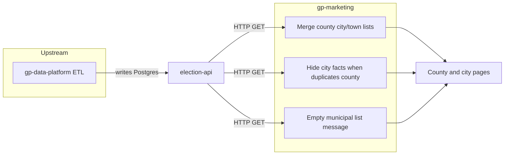

# Elections pages — known limitations and ownership

**Audience:** Product, gp-marketing, election-api, and gp-data-platform / ETL.

**Purpose:** Document upstream data gaps (what ETL should fix), how to verify them via election-api and the site, what gp-marketing already shipped, and why some issues should not be re-investigated in the marketing repo.

**Last validated:** Production election-api (`https://election-api.goodparty.org`) via curl, and gp-marketing on `http://localhost:3009` via browser — May 2026.

---

## Who owns what

| Layer | Owns |
|-------|------|
| **gp-data-platform / ETL** | `Place` rows, parent/child hierarchy, `countyName`, fun facts (population, income, `cityLargest`, etc.). Separate repo; writes Postgres directly. See election-api `docs/architecture.md` and `docs/data-model.md`. |
| **election-api** | GET-only HTTP layer over Postgres; no ETL or ingestion. Schema and endpoints: election-api `docs/architecture.md`, `docs/data-model.md`. |
| **gp-marketing** | How we query places, merge child lists, and display or hide UI when data is missing or untrustworthy. Calls election-api directly via `ELECTIONS_API_BASE_URL` in [`src/lib/electionsApi.ts`](../src/lib/electionsApi.ts) (not only via gp-api). |

gp-marketing cannot create municipal pages or correct demographics without corresponding `Place` records and fields in the database.

---

## Upstream data gaps (not fixable in gp-marketing)

| What users see | Example | Why | Marketing status | What upstream should do |
|----------------|---------|-----|------------------|-------------------------|
| Empty city/town list; county facts still name a largest city | [Braxton County, WV](https://goodparty.org/elections/wv/braxton-county) | No municipal `Place` rows for this county in the API; `cityLargest` is metadata on the county only (e.g. Gassaway) | **Done** — empty list + message; we cannot link to cities that do not exist | **ETL:** Ingest WV cities/towns; set `parentId` / children under `wv/braxton-county`; align `countyName`; or clear `cityLargest` when no children exist |
| No city facts section | [Smith Valley, NV](https://goodparty.org/elections/nv/lyon-county/smith-valley) | Town row duplicates county demographics (`cityLargest: Fernley`, same population as county) | **Done** — facts hidden intentionally | **ETL:** Localize fun facts for CDP/town geography |
| No city facts section | [Fernley, NV](https://goodparty.org/elections/nv/lyon-county/fernley) | City row matches Lyon County on all five compared fact fields in the API (population, density, median income, unemployment, home value) | **Done** — facts hidden while API data duplicates county aggregates | **ETL:** Distinct place-level demographics for `nv/fernley` |
| City facts shown | [Yerington, NV](https://goodparty.org/elections/nv/lyon-county/yerington) | Place row has distinct metrics vs county | Working | — |

### Why we do not add more “fetch state and filter” logic for Braxton

Braxton already uses state-wide city and town queries plus `countyName` filtering. An empty merged list means **there are no rows to filter**, not a wrong marketing query. Matching the county’s `cityLargest` string to a city name without a `Place` record would be fragile and out of scope for gp-marketing.

---

## Verify with curl (ETL / PM / engineering)

election-api is an internal service, but `GET /v1/places` is reachable at the host below for read-only checks. Swap the base URL for dev if needed.

```bash
BASE=https://election-api.goodparty.org
```

Use only allowed `placeColumns` (e.g. `incomeHouseholdMedian`, not `medianIncome`). Invalid columns return HTTP 400.

### Braxton — empty children

```bash
curl -sS "$BASE/v1/places?slug=wv/braxton-county&includeChildren=true&placeColumns=slug,name,cityLargest"
```

**Expect:** `children: []`, `cityLargest` set (e.g. `"Gassaway"`). No place for `wv/gassaway`:

```bash
curl -sS "$BASE/v1/places?slug=wv/gassaway&placeColumns=slug,name"
# → 404 Not Found
```

### Lyon — hierarchy vs state fallback

Hierarchy (parent/child in DB):

```bash
curl -sS "$BASE/v1/places?slug=nv/lyon-county&includeChildren=true&placeColumns=slug,name,mtfcc"
```

**Expect:** `children` includes only `nv/lyon-county/smith-valley` (town). Cities are not nested under the county slug.

State fallback (cities filtered by `countyName`):

```bash
curl -sS "$BASE/v1/places?state=NV&mtfcc=G4110&placeColumns=slug,name,countyName" \
  | jq '[.[] | select(.countyName == "Lyon")]'
```

**Expect:** `nv/fernley` and `nv/yerington` (short API slugs). gp-marketing merges these with hierarchy children on the county page.

### Smith Valley — duplicate facts

```bash
curl -sS "$BASE/v1/places?slug=nv/lyon-county/smith-valley&placeColumns=slug,population,cityLargest"
curl -sS "$BASE/v1/places?slug=nv/lyon-county&placeColumns=slug,population,cityLargest"
```

**Expect:** Same `population` (e.g. `22343`) and `cityLargest: "Fernley"` on both rows → marketing hides city facts.

### Fernley — duplicate facts vs county

```bash
curl -sS "$BASE/v1/places?slug=nv/fernley&placeColumns=slug,population,density,incomeHouseholdMedian,unemploymentRate,homeValue"
curl -sS "$BASE/v1/places?slug=nv/lyon-county&placeColumns=slug,population,density,incomeHouseholdMedian,unemploymentRate,homeValue"
```

**Expect:** All five numeric fields identical → marketing hides city facts (`hasSuspiciousFactsMatch` requires ≥2 matching fields).

### Yerington — distinct facts (working)

```bash
curl -sS "$BASE/v1/places?slug=nv/yerington&placeColumns=slug,population,density,incomeHouseholdMedian,unemploymentRate,homeValue"
curl -sS "$BASE/v1/places?slug=nv/lyon-county&placeColumns=slug,population,density,incomeHouseholdMedian,unemploymentRate,homeValue"
```

**Expect:** Different values (e.g. population `3093` vs county `22343`) → city facts section renders on the site.

---

## Verify on the site (QA / PM)

Use **canonical** paths on staging, production, or local dev (`http://localhost:3009`).

| Case | Path |
|------|------|
| Braxton empty list + message | `/elections/wv/braxton-county` |
| Lyon merged city/town list | `/elections/nv/lyon-county` |
| Fernley — no facts block | `/elections/nv/lyon-county/fernley` |
| Yerington — facts shown | `/elections/nv/lyon-county/yerington` |
| Smith Valley — no facts block | `/elections/nv/lyon-county/smith-valley` |

### API slugs vs site URLs

- **API Place slugs** can be short: `nv/fernley`, `nv/yerington`. Used by `getCountyChildPlaces` and city page resolution in [`src/lib/electionsApi.ts`](../src/lib/electionsApi.ts) and [`src/app/elections/[state]/[county]/[city]/page.tsx`](../src/app/elections/[state]/[county]/[city]/page.tsx).
- **Public site URLs** are always county-scoped: `/elections/nv/lyon-county/fernley`.
- **Do not QA with** `/elections/nv/fernley` — that hits the county route, resolves a city place, and **redirects to** `/elections/nv` (see [`src/app/elections/[state]/[county]/page.tsx`](../src/app/elections/[state]/[county]/page.tsx)).

Engineering regression tests:

```bash
bun test src/lib/electionsApi.test.ts src/lib/electionsHelpers.test.ts
```

---

## What gp-marketing shipped

### County city and town lists

We load municipalities using **two sources**, then merge and dedupe by slug:

1. **Hierarchy** — `GET /v1/places?slug={county}&includeChildren=true` (parent/child in DB).
2. **Fallback** — all cities (`mtfcc=G4110`) and towns (`mtfcc=G4040`) in the state, filtered by `countyName` vs the county slug.

Implementation: `getCountyChildPlaces` in [`src/lib/electionsApi.ts`](../src/lib/electionsApi.ts). Used on county pages and the elections index block for county slugs.

**Examples:**

- [NV Mineral County](https://goodparty.org/elections/nv/mineral-county) — Hawthorne (town / G4040) via hierarchy (`nv/mineral-county/hawthorne`).
- [CT Hartford County](https://goodparty.org/elections/ct/hartford-county) — many towns via hierarchy (fallback fails because `countyName` uses planning regions like “Capitol”, not “Hartford”).
- [NV Lyon County](https://goodparty.org/elections/nv/lyon-county) — Smith Valley via hierarchy (`nv/lyon-county/smith-valley`); Fernley and Yerington via state fallback (API slugs `nv/fernley`, `nv/yerington` → site links `/elections/nv/lyon-county/fernley`, `/elections/nv/lyon-county/yerington`).

### City “fun facts” guardrail

On city/town pages we **hide the entire facts block** when the city place row matches the parent county on **two or more** of: population, density, median income (`incomeHouseholdMedian`), unemployment, home value.

Implementation: `hasSuspiciousFactsMatch` in [`src/lib/electionsHelpers.ts`](../src/lib/electionsHelpers.ts), used in [`src/app/elections/[state]/[county]/[city]/page.tsx`](../src/app/elections/[state]/[county]/[city]/page.tsx).

### County empty municipal list

When there are **no** child places but the county row still has `cityLargest`, we show explanatory copy instead of implying the user should browse cities (e.g. Braxton pattern).

---

## Architecture (high level)



All three behaviors run at page render time using place data from election-api (`GET /v1/places`). Code: `getCountyChildPlaces`, `hasSuspiciousFactsMatch`, county `emptyMessage` in [`src/lib/electionsApi.ts`](../src/lib/electionsApi.ts) and [`src/lib/electionsHelpers.ts`](../src/lib/electionsHelpers.ts).

---

## Appendix

### Suggested ticket closure text

**gp-marketing:** Implemented county child merge (hierarchy + state fallback), aligned index block with county pages, added county empty-state messaging, and suppressed city facts when API data duplicates county metrics. Remaining gaps are documented above; no further marketing changes expected for Braxton lists or Fernley/Smith Valley facts until ETL delivers correct `Place` data.

**Blocked on ETL / gp-data-platform:**

- West Virginia municipal places (e.g. Braxton County).
- Localized fun facts for some Nevada localities (Smith Valley, Fernley).
